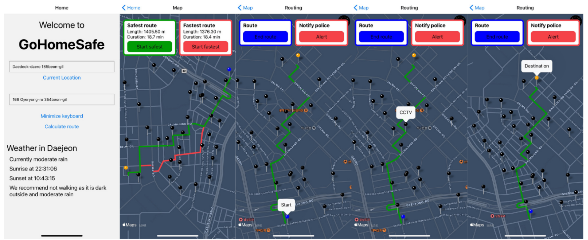

# GoHomeSafe_Mobile

>  "Roughly 6 in 10 South Korean women in their 20s and 30s feel unsafe in the streets at night [...]"
> - http://koreabizwire.com/majority-of-young-korean-women-feel-unsafe-at-night/178066

GoHomeSafe is a safety application that provides the most secure routes based on the existence of CCTV cameras along 
the route for residents in Daejeon (South Korea), particularly women. 

This repository contains the client-side code of GoHomeSafe. The server-side application can be found at 
[GoHomeSafe](https://github.com/huppertzmax/GoHomeSafe)

## Installation 
The mobile appliacation of GoHomeSafe is built with react-native and is still under developement. The application is so far only tested using Expo, direct Android or iOS usage is not yet guarantied. 

Follow the following steps to install and run the mobile application using the Expo Go App on your smarthphone: 

1. Install Node.js on your machine 
2. Clone the repository to your machine
3. Navigate to the project directory: `cd gohomesafe`
4. Install dependencies: `npm install`
5. Follow the Configurations instructions to set up your environment variables 
6. Download the Expo Go app on your mobile phone
7. Start the application: `npx expo start`
8. Scan the generated QR code with your smartphone 

## Configurations
GoHomeSafe Mobile communicates with the GoHomeSafe server as well as other external services (openweathermap.org, openrouteservice.org). 

Those need to be configured in the following way: 

1. Follow the installation instructions for the server-side of [GoHomeSafe](https://github.com/huppertzmax/GoHomeSafe)
2. Run GoHomeSafe, this will print the IP-Adress and Port of the server in the terminal
3. Create a .env file under GoHomeSafe_Mobile/gohomesafe/.env
4. Add the following line to your .env file: `EXPO_PUBLIC_URL=IP-ADRESS:PORT` where IP-ADRESS is the adress the server (not the localhost adress) and PORT the port (usually 5000)
5. Create a personal API key at openweathermap.org and openrouteservice.org
6. Add the following line to your .env file: `EXPO_PUBLIC_WEATHER_API=API-KEY` where API-KEY is your generated API key of openweathermap.org
7. Add the following line to your .env file: `EXPO_PUBLIC_ORS_API=API-KEY` where API-KEY is your generated API key of openrouteservice.org

## Background of the project 
The project represents the result of my term project undertaken within the Services Computing course at the Korea Advanced Institute of Science & Technology. 

## Warning
This project constitutes a proof of concept aimed at leveraging technology to augment safety in daily life. It is expressly stated that there is no warranty or guarantee regarding the actual safety of the routes provided within real-world scenarios. The designation of routes as "safest" is predicated upon optimization strategies that prioritize the inclusion of a maximum number of closed-circuit television (CCTV) cameras, while minimizing any significant increase in route length. It is important to note, however, that such routes are not guaranteed to be completely safe and are only considered potentially safer. 

## Future Work 
The project still contains some bugs which I will be working on in the future. On top of that the Alarm and Friend notification functionality so far only prints something to the terminal. This will be changed in future versions. Currently the routes can only be calculated in Daejeon. The next step therefore is to extend this project to more cities.

## Images
